# 🚗 Azure End-to-End Data Engineering Project: Car Sales Analytics Pipeline

## 📌 Project Overview
This project implements an enterprise-grade cloud data engineering solution that migrates transactional car sales data into a Medallion-structured Lakehouse architecture on Microsoft Azure.

It features automated metadata-driven high-watermark incremental ingestion, unified data governance using Azure Databricks with Unity Catalog, Star Schema dimensional modeling, parallelized workflow DAG orchestration, and SCD Type 1 upsert mechanics.

---

## 🏗️ Architecture & Storage Setup

### 1. Azure Infrastructure Setup
All resources—including Azure Data Factory, Azure SQL Database, ADLS Gen2 Storage, and Azure Databricks—are deployed in a unified Azure Resource Group.

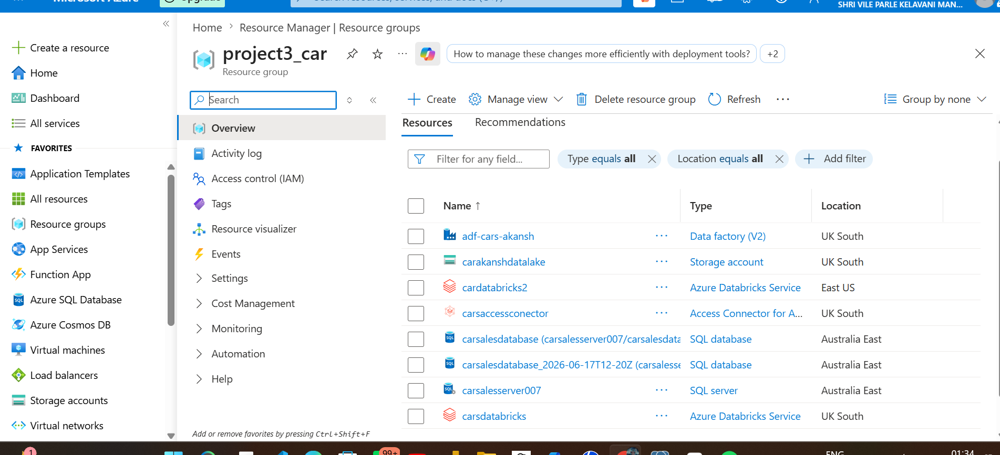

### 2. Medallion Storage Layer Structure (ADLS Gen2)
Data is organized into three distinct containers following the Medallion Architecture pattern:

#### Bronze Container (`raw_data/`)
Ingests raw transactional Parquet files extracted from the SQL source.

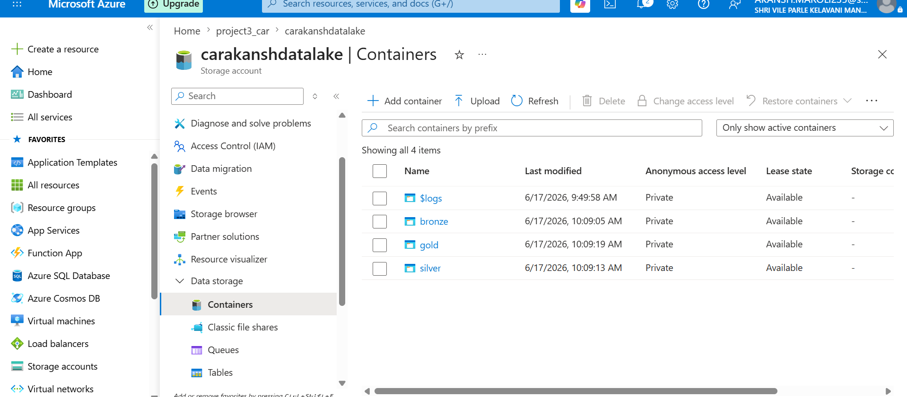
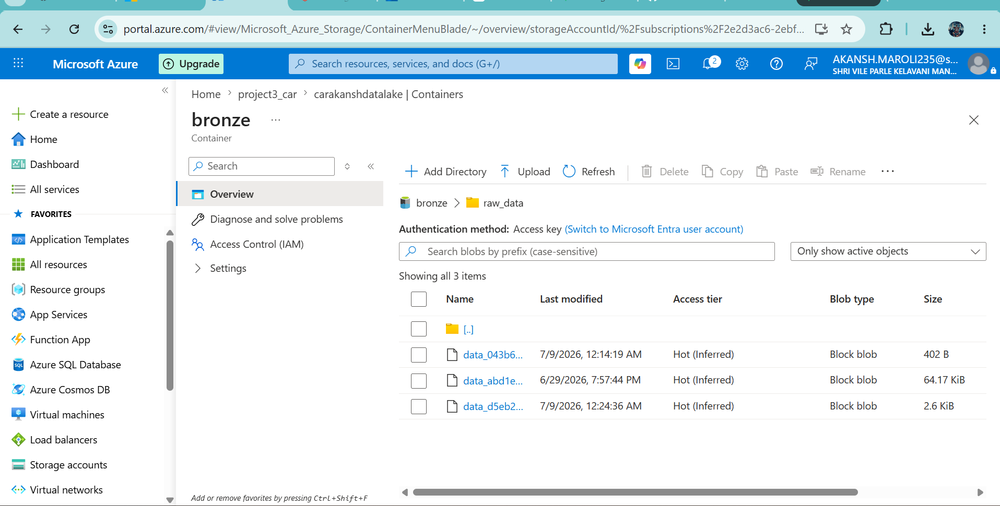

#### Silver Container (`car_sales/`)
Stores cleaned, schema-enforced, and feature-engineered Parquet datasets.

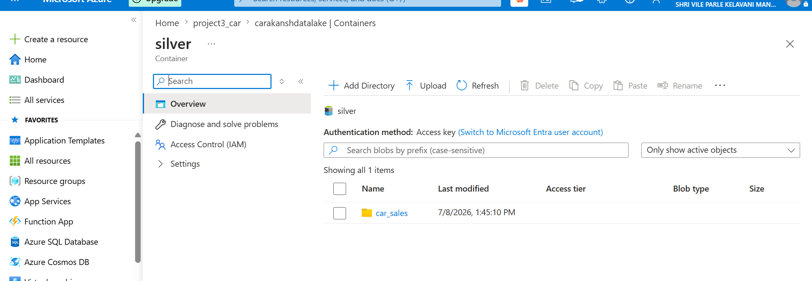

#### Gold Container (Delta Lake Storage)
Holds Star Schema dimensional Delta tables (`dim_branch`, `dim_date`, `dim_dealer`, `dim_model`, and `factsales`).

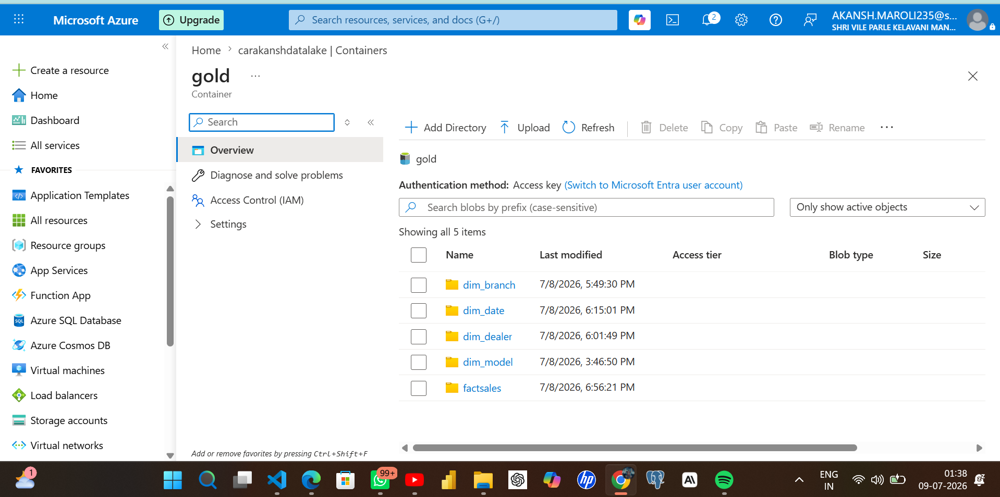
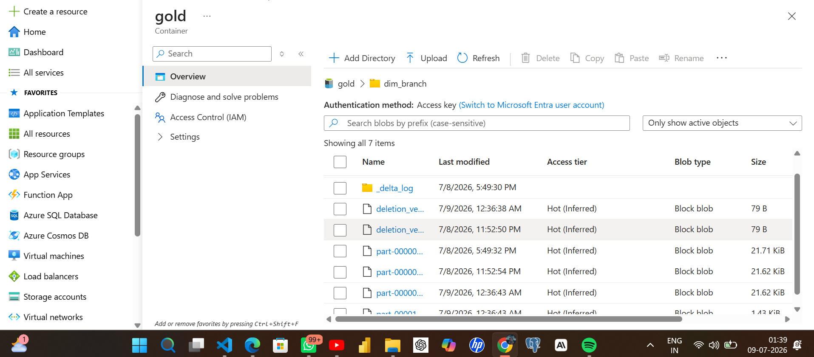

---

## 🚀 Data Pipeline Ingestion & Orchestration (ADF)

### 1. Source Preparation Pipeline (`source_prep`)
Ingests initial and incremental source dataset files from GitHub HTTP endpoints directly into Azure SQL Database (`dbo.source_cars_data`).

#### Source Configuration (Dynamic Parameter Ingestion)
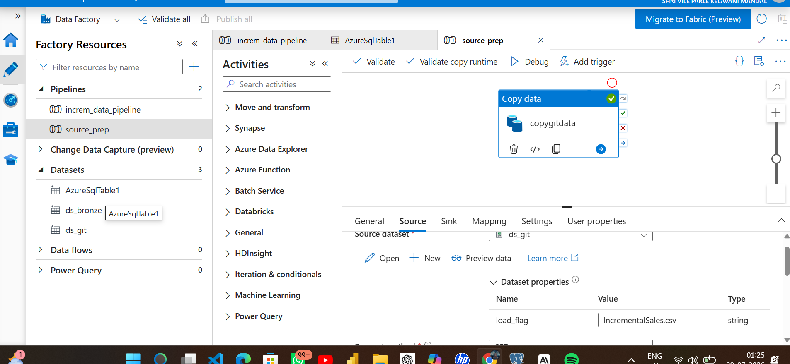

#### Sink Configuration (Azure SQL Database Ingestion)
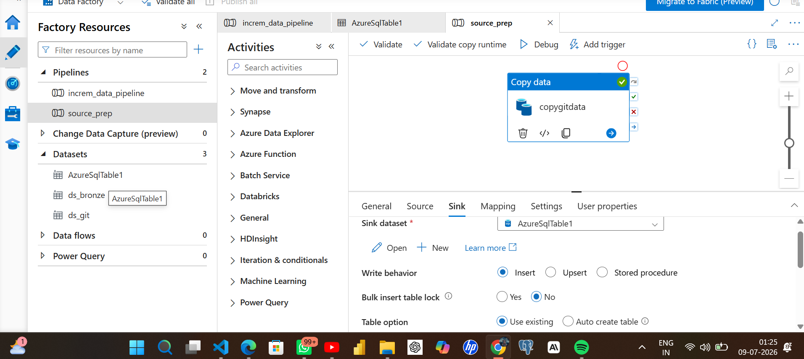
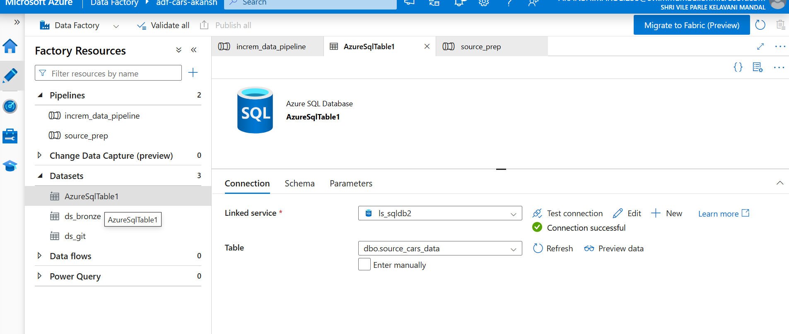

#### Execution Output
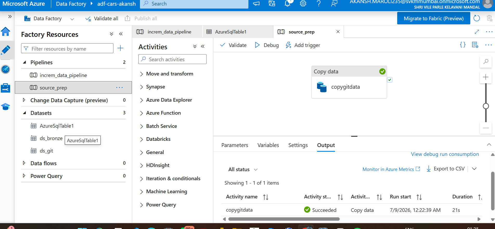

👉 [Click here to view Source Prep JSON Definition](./adf/source_prep.json)

---

### 2. Metadata-Driven Incremental Pipeline (`increm_data_pipeline`)
Executes Change Data Capture (CDC) using a high-watermark approach to query and extract only newly added records from Azure SQL into the ADLS Gen2 Bronze container.

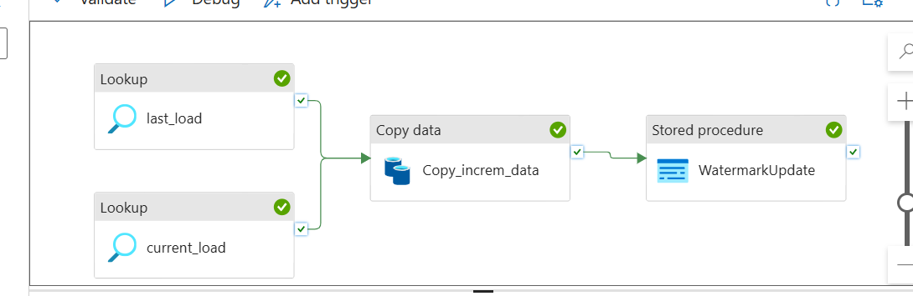

#### Ingestion Workflow Mechanics
1. **Last Load Checkpoint Lookup:** Queries `dbo.water_table` to get the last processed high-watermark (`last_load`).
   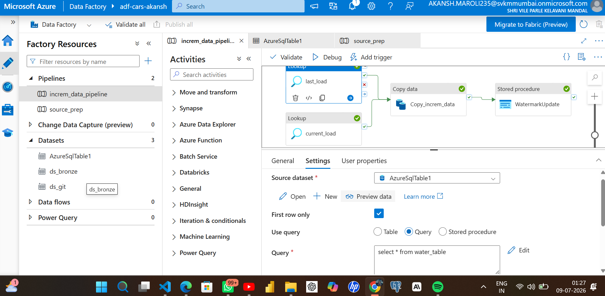

2. **Current Load Max Lookup:** Queries active transactional table `dbo.source_cars_data` for the latest maximum identifier (`SELECT MAX(Date_Id) AS max_date`).
   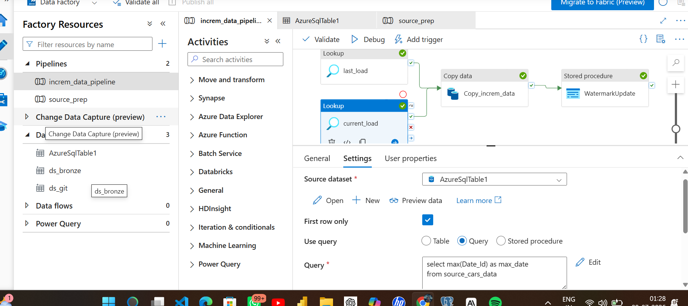

3. **Incremental Copy Activity:** Filters and pulls records where `Date_Id > last_load AND Date_Id <= max_date` and writes Snappy-compressed Parquet files to `bronze/raw_data`.
   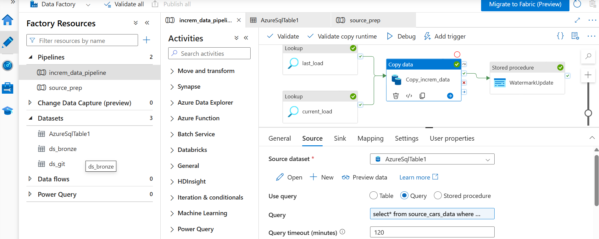
   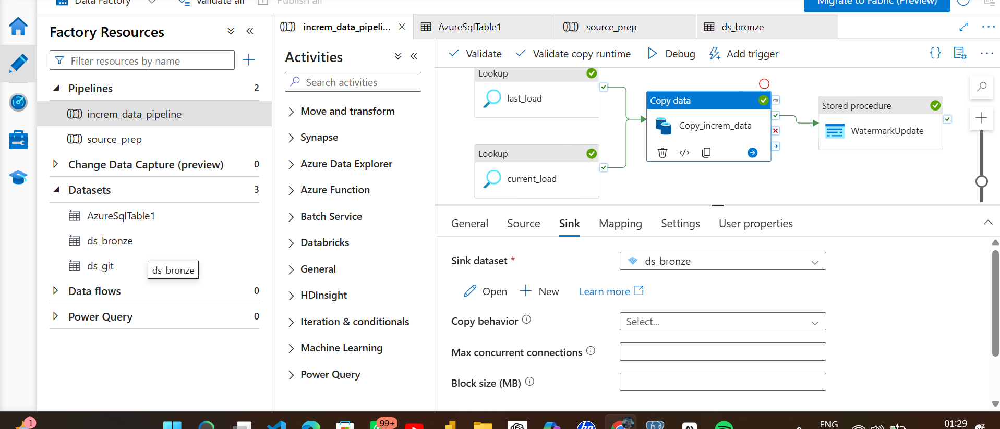
   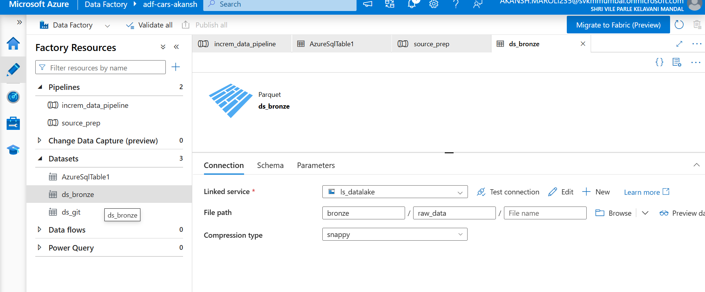

4. **Watermark State Update:** Calls stored procedure `dbo.UpdateWatermarkTable` to advance the checkpoint state to the current `max_date`.
   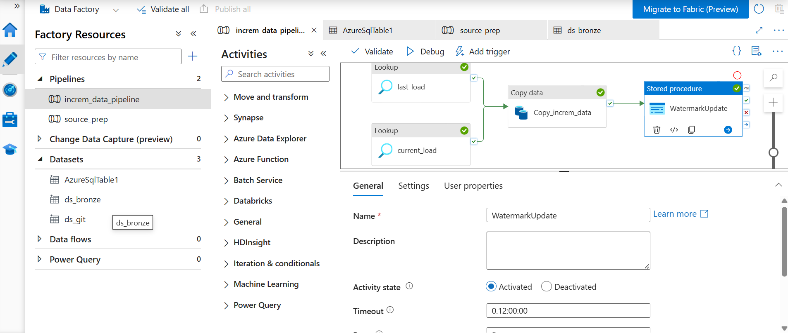
   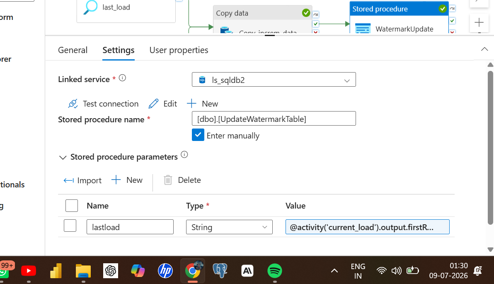
   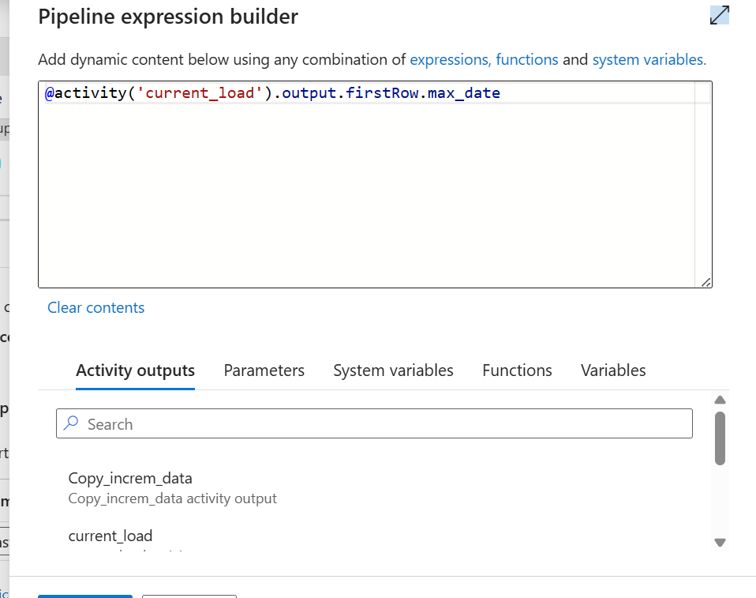

5. **Pipeline Debug Execution Output**
   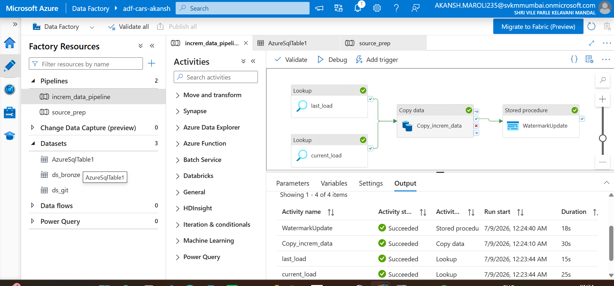

👉 [Click here to view Incremental Pipeline JSON Definition](./adf/increm_data_pipeline.json)

---

## 🗄️ Database Control & Watermark Logging

State maintenance is controlled via dedicated SQL DDL statements and transactional stored procedures.

### Watermark Query State Verification
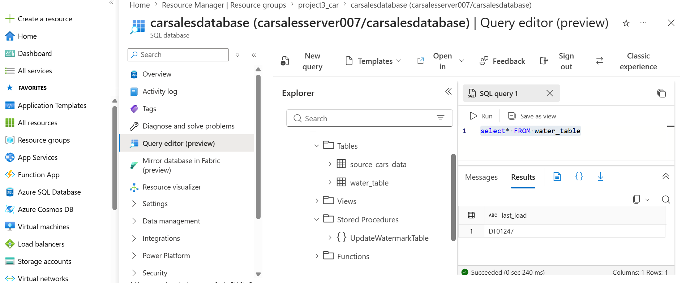

### Atomic Transaction Update Script
```sql
CREATE PROCEDURE UpdateWatermarkTable
    @lastload VARCHAR(200)
AS
BEGIN
    BEGIN TRANSACTION;
    UPDATE water_table
    SET last_load = @lastload;
    COMMIT TRANSACTION;
END;
```

👉 [Click here to view full SQL database setup scripts](./database_scripts/watermark_control_setup.sql)

## 🔐 Lakehouse Security & Governance (Unity Catalog)

Rather than using legacy root DBFS directory mounts, governance and storage access are managed via Unity Catalog and standard Azure Security Controls.

### Identity & Access Management (IAM)

An Azure Access Connector managed identity (`carsaccessconector`) is assigned Storage Blob Data Contributor access on the ADLS Gen2 lakehouse.

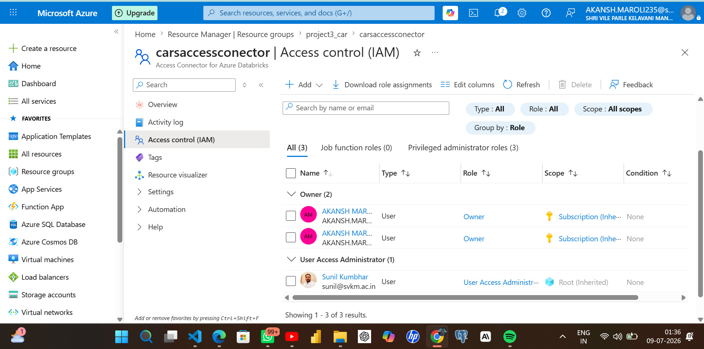

### External Locations & Catalog

Unity Catalog external locations utilize the storage credential bound to the Access Connector, enforcing strict schema control across silver and gold layers.

# 🛠️ Databricks Transformations & Star Schema Modeling

Transformations are built using PySpark inside Databricks notebooks.

## 1. Silver Layer (`silver_notebook.py`)

Cleanses raw ingestion datasets from Bronze.

Performs feature engineering (e.g., parsing `model_id` using `split()` and `withColumn()` to generate `model_category`).

Calculates operational KPIs such as `Revenue_per_unit`.

Overwrites standardized Parquet records into `silver/car_sales/`.

## 2. Gold Layer Star Schema (`gold_dim_*.py` & `gold_fact_sales.py`)

### Surrogate Key Generation

Calculates dynamic surrogate key offsets (`monotonically_increasing_id() + max_key`) to handle continuous ID assignment during incremental stream runs.

### SCD Type 1 Upserts

Implements Slowly Changing Dimensions (SCD Type 1) via PySpark `DeltaTable.merge()` functions to update existing dimension attribute changes and insert new records seamlessly.

### Fact Table Integration

Combines numerical metrics (`Revenue`, `Units_Sold`, `Revenue_per_unit`) with the newly generated surrogate keys (`dim_branch_key`, `dim_date_key`, `dim_dealer_key`, `dim_model_key`).

👉 [Click here to explore all Databricks transformation PySpark code](./databricks_notebooks/)

---

## 🔄 Workflow Orchestration DAG (Databricks Workflows)

The downstream Silver-to-Gold pipeline execution is orchestrated using Databricks Jobs (Workflows).

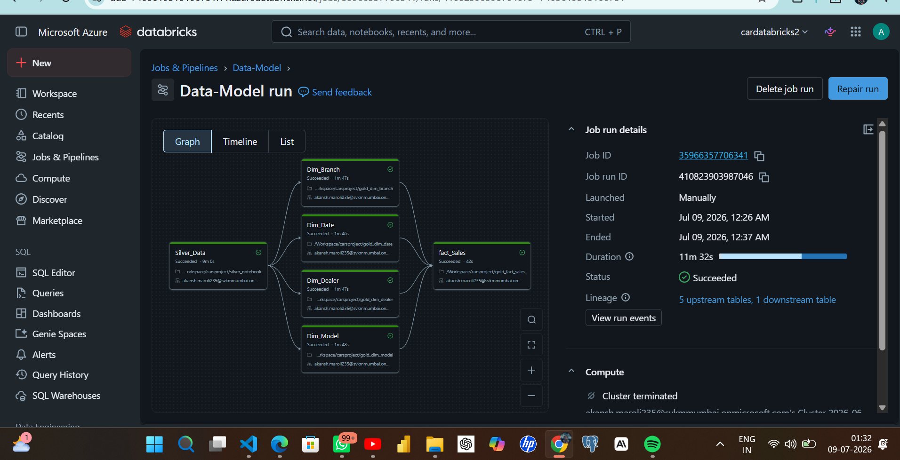

### Parallel Execution Flow

- **Silver_Data Task:** Processes raw Bronze data into Silver Parquet format.
- **Parallel Dimension Tasks:** Once Silver completes, four dimension tasks (**Dim_Branch**, **Dim_Date**, **Dim_Dealer**, **Dim_Model**) trigger simultaneously in parallel to execute their respective SCD Type 1 merge routines.
- **fact_Sales Task:** Triggers automatically upon the successful completion of all upstream dimension tasks to write updated Star Schema fact data to Gold.

---

## 📊 Interactive Notebook Execution Logs

Full cell outputs, data preview tables, and execution metrics are captured as standalone HTML files, enabling offline verification without an active Azure subscription.

👉 [Click here to view interactive execution snapshots](./execution_snapshots/)
